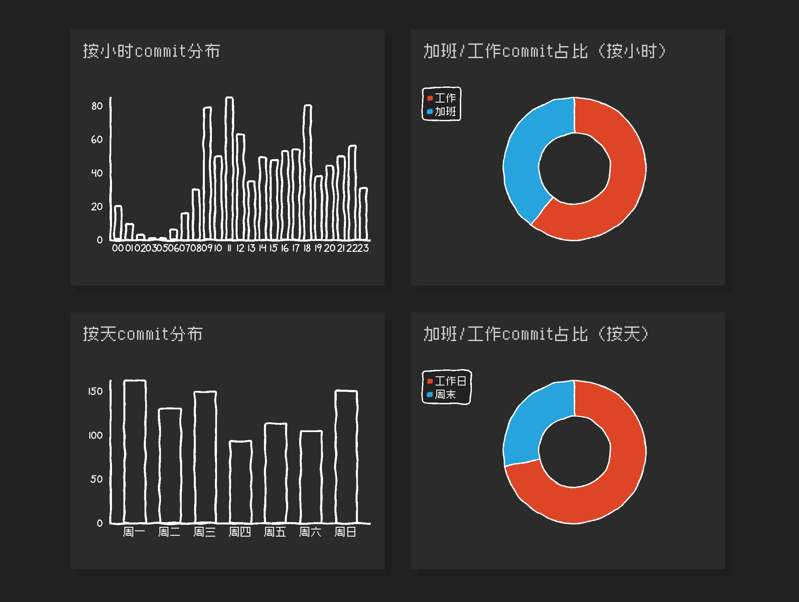
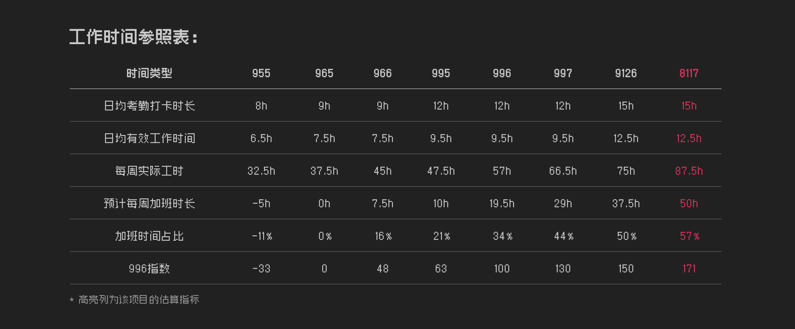

# code996 Python Local Version

Python local implementation based on [hellodigua/code996](https://github.com/hellodigua/code996).

Analyze Git commit time distribution, calculate 996 index, and generate beautiful local visualization reports.

[简体中文](./README.md) | English

## Features

Compared to the original version, the local version provides:

- **Fully Local** - Data is not transmitted via URL, more secure and private
- **Standalone HTML Reports** - Generate complete reports that can be viewed offline
- **Visual Consistency** - Pixel fonts + hand-drawn style charts, fully restored original effect
- **Flexible Customization** - Rich command-line parameters, support batch processing
- **Ready to Use** - Pure Python implementation, no third-party libraries required
- **Smart Clone** - Remote repositories download only Git history, saving space and time
- **Repository Reuse** - Cloned remote repositories can be reused
- **Multi-Repo Aggregation** ⭐ - Support batch analysis of multiple repositories with aggregated reports

## Preview

Analyze basic Git project information:


View commit distribution through charts:



Compare project work time types:



## Quick Start

### Basic Usage

Run in your Git project root directory:

```bash
python code996_local.py
```

The script will automatically:
1. Analyze Git commit history
2. Calculate 996 index
3. Generate HTML report (saved in `report/` directory)
4. Open in browser

### Common Commands

```bash
# Single repository analysis
# Specify time range
python code996_local.py --start 2024-01-01 --end 2024-12-31

# Analyze specific developer
python code996_local.py --author "John Doe"

# Analyze other local projects
python code996_local.py --repo /path/to/project

# Analyze remote Git repository
python code996_local.py --url https://github.com/user/repo

# Multi-repository aggregated analysis ⭐ New Feature
# Method 1: Comma-separated local repositories
python code996_local.py --repos /path/repo1,/path/repo2,/path/repo3 --project-name "Team Backend"

# Method 2: Comma-separated remote repositories
python code996_local.py --urls https://github.com/org/repo1,https://github.com/org/repo2

# Method 3: Multiple parameters (can mix local and remote)
python code996_local.py --repo /local/repo1 --repo /local/repo2 --url https://github.com/org/repo3

# Method 4: Read from file
python code996_local.py --input-file repos.txt --project-name "Q4 Projects"

# Custom output file (can specify path)
python code996_local.py --output my_report.html
python code996_local.py --output /path/to/report.html

# Windows users can double-click
code996_local.bat
```

## Parameters

| Parameter | Description | Default |
|------|------|--------|
| `--start, -s` | Start date (YYYY-MM-DD) | 2022-01-01 |
| `--end, -e` | End date (YYYY-MM-DD) | Today |
| `--author, -a` | Specify author (name/email) | All |
| `--repo, -r` | Local Git repository path | Current directory |
| `--url, -u` | Remote Git repository URL ⭐ | None |
| `--output, -o` | Output file name | report/project·timestamp-result.html ⭐ |
| `--no-browser` | Don't open browser automatically | - |
| `--help, -h` | Show help | - |

## Use Cases

### 1. Understand Overtime at New Company
```bash
# Local project
cd /path/to/company/project
python code996_local.py

# Or analyze remote repository directly (no cloning needed)
python code996_local.py --url https://github.com/company/project
```

### 2. Personal Annual Work Summary
```bash
python code996_local.py --author "My Name" --start 2024-01-01
```

### 3. Quick Analysis of Open Source Projects
```bash
# No manual cloning needed, analyze directly (only downloads Git history)
python code996_local.py --url https://github.com/torvalds/linux
python code996_local.py --url https://github.com/facebook/react

# Repositories are saved in online_project/ directory for reuse
# Next time, use the already downloaded repository (faster):
python code996_local.py --repo online_project/torvalds-linux
```

### 4. Team Multi-Project Aggregation ⭐ New Feature
```bash
# Analyze all microservice repositories of a team
python code996_local.py \
  --repos /srv/api,/srv/web,/srv/worker,/srv/scheduler \
  --project-name "Backend Team Q4" \
  --start 2024-10-01

# Analyze overall activity of multiple open source projects
python code996_local.py \
  --urls https://github.com/vuejs/core,https://github.com/vuejs/router,https://github.com/vuejs/pinia \
  --project-name "Vue Ecosystem"

# Batch read repositories from file (supports mixed local and remote)
cat > my_projects.txt << EOF
# My project list
/home/user/project1
/home/user/project2
https://github.com/myteam/repo1
https://github.com/myteam/repo2
EOF

python code996_local.py --input-file my_projects.txt --project-name "My Projects 2024"
```

### 5. Compare Multiple Projects (Generate Separate Reports)
```bash
# Local projects
for proj in proj1 proj2 proj3; do
    python code996_local.py --repo /path/$proj --output ${proj}.html
done

# Remote projects
python code996_local.py --url https://github.com/user/repo1 --output repo1.html
python code996_local.py --url https://github.com/user/repo2 --output repo2.html
```

### 6. Regular Weekly Reports
```bash
python code996_local.py --output weekly_$(date +%Y%m%d).html
```

## 📊 996 Index Explanation

996 Index = Overtime Percentage × 3

| Index | Meaning |
|------|------|
| < 0 | Under-saturated work, very relaxed |
| 0-10 | No overtime, work-life balance |
| 10-50 | Light overtime |
| 50-90 | Moderate overtime |
| 90-110 | Heavy overtime (close to 996) |
| **100** | **Standard 996 (9AM-9PM, 6 days/week)** |
| \> 110 | Extreme overtime |

## Core Algorithm

### Work Time Recognition

Using Root Mean Square (RMS) algorithm to identify work hours:

```python
# Calculate standard value
standard_value = sqrt(sum(count²) / total_hours)

# Filter work hours (threshold 0.45)
work_hours = [h for h in hours if h.count / standard_value >= 0.45]

# Identify start time (earliest between 8-12)
opening_time = min([h for h in work_hours if 8 <= h <= 12])

# Identify end time (latest between 17-23)
closing_time = max([h for h in work_hours if 17 <= h <= 23])
```

### 996 Index Calculation

```python
# Work time: 9 hours from start time
work_commits = commits_in(opening_time, opening_time + 9)
overtime_commits = total_commits - work_commits

# Weekend adjustment (all weekend counts as overtime)
adjusted_overtime = overtime_commits + 
    (work_commits * weekend_commits / (weekday_commits + weekend_commits))

# Calculate index
overtime_ratio = adjusted_overtime / total_commits * 100
index_996 = overtime_ratio * 3
```

## Technical Implementation

### Key Technologies

1. **SVG Chart Rendering** - Use [chart.xkcd](https://github.com/timqian/chart.xkcd) for hand-drawn style charts
2. **Pixel Fonts** - Use [zpix](https://github.com/SolidZORO/zpix-pixel-font) pixel font and vcr-osd retro font
3. **Dark Theme** - #212121 background, #2a2a2a cards, fully restored original version
4. **Pure Python** - Only standard library, no third-party dependencies

### Comparison with Original

| Feature | Original (Online) | Python Local Version |
|------|------------|--------------|
| Usage | Bash + Online page | Python script |
| Data Transfer | URL parameters | Fully local ✅ |
| Report Form | Online page | Standalone HTML ✅ |
| Customization | Limited | Rich parameters ✅ |
| Batch Processing | Not supported | Supported ✅ |
| Privacy | General | Excellent ✅ |

## System Requirements

- Python 3.6+
- Git command-line tool
- No Python third-party libraries required

## FAQ

### "Git command execution failed"

Make sure current directory is a Git repository:
```bash
git status  # Check if it's a Git repository
```

### Commit count is 0

Adjust time range:
```bash
python code996_local.py --start 2020-01-01
```

### Remote repository clone is slow

Using `--bare` clone, only downloads Git history without working files, much faster:
```bash
# Already optimized, automatically uses bare clone
python code996_local.py --url https://github.com/user/repo
```

### How to reuse cloned repositories

```bash
# First time clone (saved in online_project directory)
python code996_local.py --url https://github.com/facebook/react

# Next time use the already cloned repository (no re-download)
python code996_local.py --repo online_project/facebook-react
```

### Charts not displaying

Check network connection (CDN resources needed):
- chart.xkcd library (~50KB)
- zpix font (~90KB)
- vcr-osd font (~20KB)

### Fully Offline Usage

Download the following files locally and modify CDN links in the script:
- https://cdn.jsdelivr.net/npm/chart.xkcd@1.1.13/dist/chart.xkcd.min.js
- https://fastly.jsdelivr.net/gh/hellodigua/cdn/fonts/zpix.woff2
- https://fastly.jsdelivr.net/gh/hellodigua/cdn/fonts/vcr-osd.ttf

## How It Works

### Data Source

Retrieve commit history via `git log` command:
```bash
# Hourly statistics
git log --date=format:%H --after="start" --before="end" | grep "Date:"

# Weekly statistics
git log --date=format:%u --after="start" --before="end" | grep "Date:"
```

### Analysis Steps

1. Count commits by hour and by day
2. Use RMS algorithm to identify work time range
3. Calculate work time and overtime commit distribution
4. Adjust based on weekend work
5. Calculate 996 index and generate report

## Important Notes

1. **Analysis results are for reference only**, do not constitute any advice
2. **Commit time ≠ actual work time**, meetings, documentation, etc. are not included
3. **Cross-timezone projects** may have inaccurate statistics
4. **Personal projects** (irregular work hours) may also be inaccurate
5. **Too few commits** (< 50) have limited reference value
6. **Multi-Repository Aggregation**:
   - Aggregation mode merges commit time data from all repositories
   - Different repositories may come from different timezones and teams, which may introduce some errors
   - Individual repository failures will not interrupt the overall analysis
   - The report shows detailed information and proportion for each repository

## Acknowledgments

This project is a modification of [hellodigua/code996](https://github.com/hellodigua/code996).

Thanks to the original author [@hellodigua](https://github.com/hellodigua) and all other contributors.

### Related Projects

- Original project: https://github.com/hellodigua/code996
- Online demo: https://hellodigua.github.io/code996/
- chart.xkcd: https://github.com/timqian/chart.xkcd
- zpix font: https://github.com/SolidZORO/zpix-pixel-font
- 996.ICU: https://github.com/996icu/996.ICU

## License

This project follows the original project's [MIT](LICENSE) license.

---

**Project URL**: https://github.com/hellodigua/code996  
**Python Local Version Author**: Modified from original project

Issues and Pull Requests are welcome.

