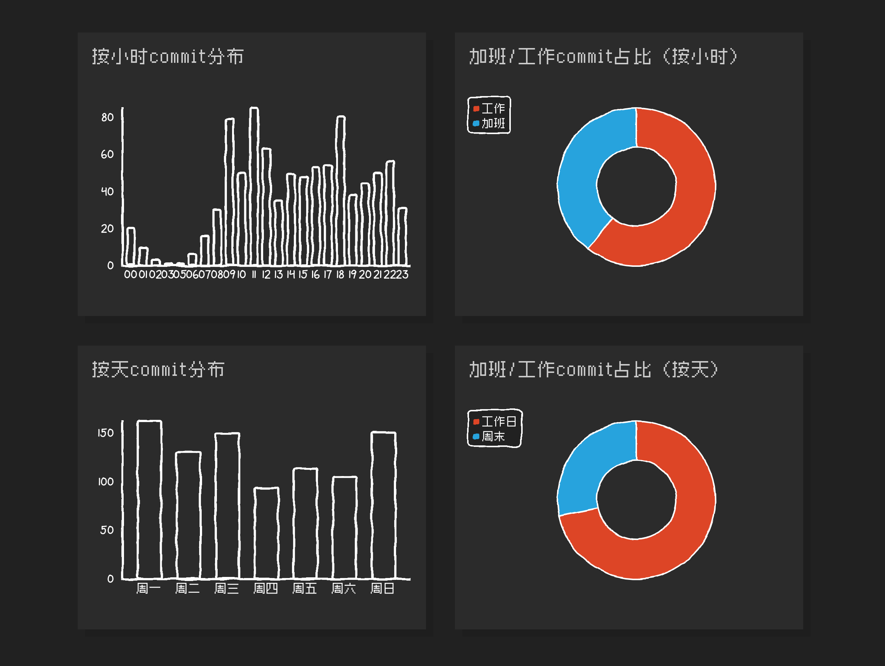

# code996 Python 本地版

基于 [hellodigua/code996](https://github.com/hellodigua/code996) 的 Python 本地化实现。

统计 Git 项目的 commit 时间分布，计算 996 指数，生成精美的本地可视化报告。

简体中文 | [English](./README-en_US.md)

##  特点

相比原版，本地版提供：

-  **完全本地化** - 数据不通过 URL 传输，更安全私密
-  **独立 HTML 报告** - 一键生成可离线查看的完整报告
-  **视觉完全一致** - 像素字体 + 手绘风格图表，还原原版效果
-  **灵活自定义** - 丰富的命令行参数，支持批量处理
-  **开箱即用** - 纯 Python 实现，无需安装第三方库

##  预览

分析 Git 项目的基本情况：


通过图表查看 commit 提交分布：



对比项目工作时间类型：


##  快速开始

### 基础使用

在 Git 项目根目录运行：

```bash
python code996_local.py
```

脚本会自动：
1. 分析 Git 提交历史
2. 计算 996 指数
3. 生成 HTML 报告（保存在 `report/` 目录）
4. 在浏览器中打开

### 常用命令

```bash
# 指定时间范围
python code996_local.py --start 2024-01-01 --end 2024-12-31

# 分析特定开发者
python code996_local.py --author "张三"

# 分析本地其他项目
python code996_local.py --repo /path/to/project

# 分析远程 Git 仓库 ⭐ 新功能
python code996_local.py --url https://github.com/user/repo

# 自定义输出文件（可指定路径）
python code996_local.py --output my_report.html
python code996_local.py --output /path/to/report.html

# Windows 用户直接双击
code996_local.bat
```

##  参数说明

| 参数 | 说明 | 默认值 |
|------|------|--------|
| `--start, -s` | 起始日期 (YYYY-MM-DD) | 2022-01-01 |
| `--end, -e` | 结束日期 (YYYY-MM-DD) | 今天 |
| `--author, -a` | 指定作者 (name/email) | 全部 |
| `--repo, -r` | 本地 Git 仓库路径 | 当前目录 |
| `--url, -u` | 远程 Git 仓库 URL ⭐ | 无 |
| `--output, -o` | 输出文件名 | report/项目名·时间戳-result.html ⭐ |
| `--no-browser` | 不自动打开浏览器 | - |
| `--help, -h` | 显示帮助 | - |

##  使用场景

### 1. 了解新公司加班情况
```bash
# 本地项目
cd /path/to/company/project
python code996_local.py

# 或直接分析远程仓库（无需克隆）
python code996_local.py --url https://github.com/company/project
```

### 2. 个人年度工作总结
```bash
python code996_local.py --author "我的名字" --start 2024-01-01
```

### 3. 快速分析开源项目
```bash
# 无需手动克隆，直接分析
python code996_local.py --url https://github.com/torvalds/linux
python code996_local.py --url https://github.com/facebook/react
```

### 4. 对比多个项目
```bash
# 本地项目
for proj in proj1 proj2 proj3; do
    python code996_local.py --repo /path/$proj --output ${proj}.html
done

# 远程项目
python code996_local.py --url https://github.com/user/repo1 --output repo1.html
python code996_local.py --url https://github.com/user/repo2 --output repo2.html
```

### 5. 定期生成周报
```bash
python code996_local.py --output weekly_$(date +%Y%m%d).html
```

## 📊 996 指数说明

996 指数 = 加班时间占比 × 3

| 指数 | 含义 |
|------|------|
| < 0 | 工作不饱和，非常轻松 |
| 0-10 | 无加班，工作生活平衡 |
| 10-50 | 轻度加班 |
| 50-90 | 中度加班 |
| 90-110 | 重度加班（接近996） |
| **100** | **标准 996（早9晚9，每周6天）** |
| \> 110 | 超重度加班 |

##  核心算法

### 工作时间识别

使用平方平均数（RMS）算法识别工作时间：

```python
# 计算标准值
standard_value = sqrt(sum(count²) / total_hours)

# 筛选工作时间（阈值 0.45）
work_hours = [h for h in hours if h.count / standard_value >= 0.45]

# 识别上班时间（8-12点中最早的）
opening_time = min([h for h in work_hours if 8 <= h <= 12])

# 识别下班时间（17-23点中最晚的）
closing_time = max([h for h in work_hours if 17 <= h <= 23])
```

### 996 指数计算

```python
# 工作时间：从上班时间开始的 9 小时
work_commits = commits_in(opening_time, opening_time + 9)
overtime_commits = total_commits - work_commits

# 周末修正（周末全部算加班）
adjusted_overtime = overtime_commits + 
    (work_commits * weekend_commits / (weekday_commits + weekend_commits))

# 计算指数
overtime_ratio = adjusted_overtime / total_commits * 100
index_996 = overtime_ratio * 3
```

##  技术实现

### 关键技术点

1. **SVG 图表渲染** - 使用 [chart.xkcd](https://github.com/timqian/chart.xkcd) 绘制手绘风格图表
2. **像素字体** - 使用 [zpix](https://github.com/SolidZORO/zpix-pixel-font) 像素字体和 vcr-osd 复古字体
3. **深色主题** - #212121 背景，#2a2a2a 卡片，完全还原原版
4. **纯 Python** - 仅使用标准库，无第三方依赖

### 与原版对比

| 特性 | 原版（在线） | Python 本地版 |
|------|------------|--------------|
| 使用方式 | Bash + 在线页面 | Python 脚本 |
| 数据传输 | URL 参数 | 完全本地 ✅ |
| 报告形式 | 在线页面 | 独立 HTML ✅ |
| 自定义性 | 有限 | 丰富参数 ✅ |
| 批量处理 | 不支持 | 支持 ✅ |
| 隐私保护 | 一般 | 优秀 ✅ |

##  系统要求

- Python 3.6+
- Git 命令行工具
- 无需安装任何 Python 第三方库

##  常见问题

### 提示 "Git命令执行失败"

确保当前目录是 Git 仓库：
```bash
git status  # 检查是否为 Git 仓库
```

### commit 数量为 0

调整时间范围：
```bash
python code996_local.py --start 2020-01-01
```

### 图表不显示

检查网络连接（需要加载 CDN 资源）：
- chart.xkcd 库（~50KB）
- zpix 字体（~90KB）
- vcr-osd 字体（~20KB）

### 完全离线使用

下载以下文件到本地，并修改脚本中的 CDN 链接：
- https://cdn.jsdelivr.net/npm/chart.xkcd@1.1.13/dist/chart.xkcd.min.js
- https://fastly.jsdelivr.net/gh/hellodigua/cdn/fonts/zpix.woff2
- https://fastly.jsdelivr.net/gh/hellodigua/cdn/fonts/vcr-osd.ttf

##  原理说明

### 数据来源

通过 `git log` 命令获取提交历史：
```bash
# 按小时统计
git log --date=format:%H --after="start" --before="end" | grep "Date:"

# 按星期统计  
git log --date=format:%u --after="start" --before="end" | grep "Date:"
```

### 分析步骤

1. 统计每小时和每天的 commit 数量
2. 使用 RMS 算法识别工作时间范围
3. 计算工作时间和加班时间的 commit 分布
4. 根据周末工作情况进行修正
5. 计算 996 指数并生成报告

##  注意事项

1. **分析结果仅供参考**，不构成任何建议
2. **commit 时间 ≠ 实际工作时间**，还有开会、文档等
3. **跨时区项目**统计结果可能不准确
4. **个人项目**（工作时间不固定）也不准确
5. **commit 数量过少**（< 50）结果参考价值有限

##  致谢

本项目基于 [hellodigua/code996](https://github.com/hellodigua/code996) 改造。

感谢原作者 [@hellodigua](https://github.com/hellodigua) 和其它所有贡献者。

### 相关项目

- 原项目：https://github.com/hellodigua/code996
- 在线演示：https://hellodigua.github.io/code996/
- chart.xkcd：https://github.com/timqian/chart.xkcd
- zpix 字体：https://github.com/SolidZORO/zpix-pixel-font
- 996.ICU：https://github.com/996icu/996.ICU

##  许可

本项目遵循原项目的 [MIT](LICENSE) 许可。

---

**项目地址**: https://github.com/hellodigua/code996  
**Python 本地版作者**: 基于原项目改造

如有问题欢迎提 Issue 或 Pull Request。
